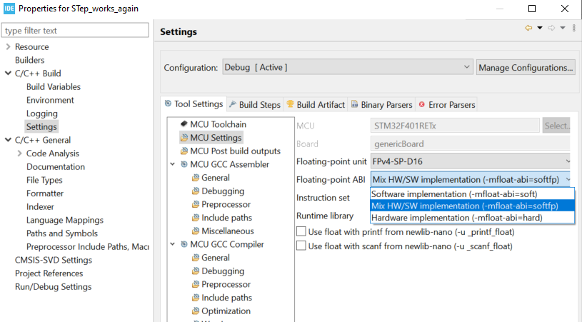

# I2C & Stepper Modul [ARM Balancer]


## Table of Contents


  - [Installation](#installation)
  - [Example](#usageexamples)
  - [Authors](#@author)


## Installation

1.  create new project in the STM32CubeIDE
2.  copy the content of `Examples/Test_Step_Motor.c` into the `main.c` of your project
3. copy the `system_stm32f4xx.c` from `CMSIS/Src/` to `YOURPROJECT/Src/`
4. change the properties of your project 
   1. open the properties of your project then expand `C/C++ Build` → `Settings` → `MCU Settings`
  &nbsp;
   1. make sure `Floating-point unit` is set to `FPv4-SP-D16`  
   2. set the `Floating-point ABI` to `mix HW/SW implementation (-mfloat-abi=softfp)`
   3. expand `C/C++ Build` → `Settings` → expand `MCU GCC Assembler` → `Include paths` and add the following paths:
      ```
      "${workspace_loc:/Balancer}"
      "${workspace_loc:/MCAL}"
      "${workspace_loc:/CMSIS}"
      ```
      
   1. expand `C/C++ Build` → `Settings` → expand `MCU GCC Compiler` → `Include paths` and add the following paths:
      ```
      "${workspace_loc:/Balancer}"
      "${workspace_loc:/MCAL}"
      "${workspace_loc:/CMSIS}"
      "${workspace_loc:/MCAL/Inc}"
      "${workspace_loc:/MCAL/Inc/mcalTimer}"
      "${workspace_loc:/CMSIS/Include}"
      "${workspace_loc:/CMSIS/Device/ST/STM32F4xx/Include}"
      "${workspace_loc:/Balancer/Inc}"
      "${workspace_loc:/Balancer/Src}"
      ```
   2. expand `C/C++ Build` → `Settings` → expand `MCU GCC Linker` → `Libraries` → `Libraries (-l)` and add the following text:
      ```
      Balancer
      MCAL
      CMSIS
      ```

   3. on the same page in the `Library search path (-L)` section add these paths:
      ```
      "${workspace_loc:/Balancer/Inc}"
      "${workspace_loc:/Balancer/Src}"
      "${workspace_loc:/Balancer/Debug}"
      "${workspace_loc:/MCAL/Debug}"
      "${workspace_loc:/MCAL/Debug/Src}"
      "${workspace_loc:/MCAL/Debug/Src/mcalTimer}"
      "${workspace_loc:/CMSIS/Debug}"
      "${workspace_loc:/CMSIS/Device/ST/STM32F4xx/Source/Templates}"
      ```

    4. expand `C/C++ General` → `Paths and Symbols` select the `Debug` configuration. Open the `References` tab and make sure the checkboxes of the following items are checked:
       ```
       Balancer
       MCAL
       CMSIS
       ```

5. try to debug
6. if any errors occur 
   1. delete the `MCAL401` if it shows up in step 4
   2. make sure to the libraries are include in the right order (shown above)

 


## Examples

```c
#include <stdint.h>
#include <stdbool.h>
#include <stepper.h>
#include <i2c.h>

uint8_t *convDecByteToHex(uint8_t byte);
uint8_t vmax;
uint8_t addr = 0xC2; 	// Schreibadresse des Motors
uint8_t geschw = 0x00;	// 0x0 bis 0xF

int main(void)
{
    
	//StepL.init(... 						iRun,	iHold, 	vMin,  	vMax, 	stepMode, rotDir, acceleration, securePosition)
	StepperInit(&StepL, i2c, i2cAddr_motL, 	14, 	1,  	2, 		14, 		3, 			1, 		6,			 0);
    
	
// ab hier umstellen auf struct amis.c
	/* Hauptprogramm: Endlosschleife */
    while(1)
    {
    	for(int i = 0; i < 500; ++i )
    	{
    	int ac_pos = getActualPosition(0xC2); // Auslesen der aktuellen Motorposition
    	setPosition(addr,  ac_pos+32767);

    	}
    	softStop(0xc2); 		// Stoppt den Aktuellen Befehl

    	setVmax(addr, geschw); // Stetzt die Geschwindigkeit des Steppers
    	geschw++;

    	if(geschw == 0xf)
    	{
    		geschw = 0x00;
    	}
    }
    return 0;
}
```


## Authors

- [Stefan Heinrich](mailto:stefan.heinrich@dhbw-engineering.de)
- [Dennis Lotz](mailto:dennis.lotz@dhbw-engineering.de)

